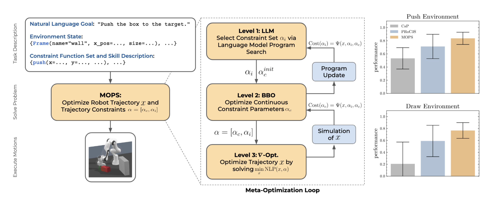

# MOPS🐶



Open-source code-release for paper ["Meta-Optimization and Program Search using Language Models for Task and Motion Planning"](https://arxiv.org/abs/2505.03725).

This code is build on ["PRoC3S"](https://github.com/Learning-and-Intelligent-Systems/proc3s).

## Setup
```
conda create -n "mops" python=3.10
conda activate mops
python -m pip install -e .
```

## Add your OpenAI Key

```
echo "OPENAI_KEY='<YOUR-KEY-HERE>'" > .env
```

## Example commands
The main run file is `eval_policy.py`. Running a particular domain involves simply creating a config file in the `vtamp/config` directory and running `eval_policy.py` using the `--config-dir .` and `--config_name` flags.

Here are a few example commands to give you an idea:

```
# Our approach on a task with goal "draw a rectangle that encloses two obstacles".
python eval_policy.py --config-name=mops_draw_pentagon

```

## Citation

If you find our code useful for your research, please cite:
```
@inproceedings{shcherba2025mops,
  title     = {Meta-Optimization and Program Search using Language Models for Task and Motion Planning}, 
  author    = {Denis Shcherba and Eckart Cobo-Briesewitz and Cornelius V. Braun and Marc Toussaint},
  year      = {2025},
  booktitle = {Conference on Robot Learning}
}
```
